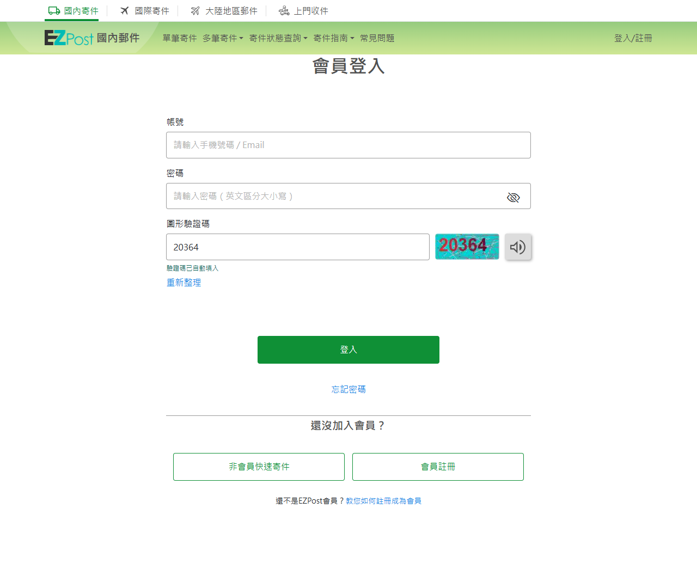
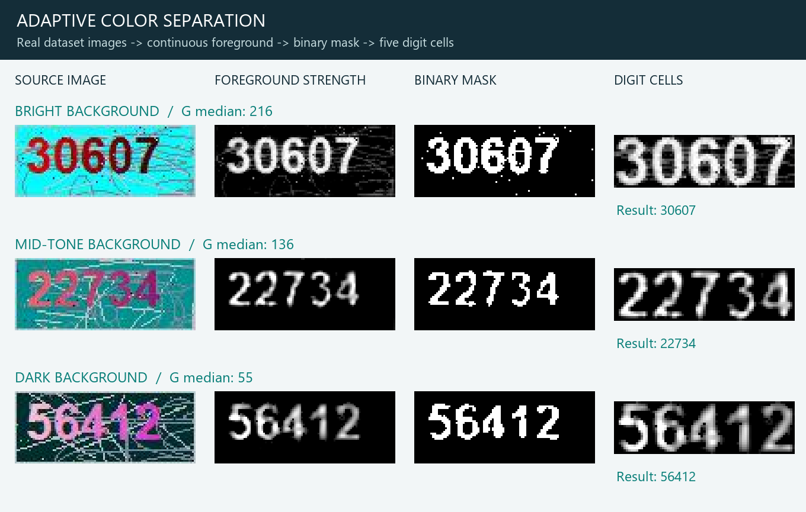
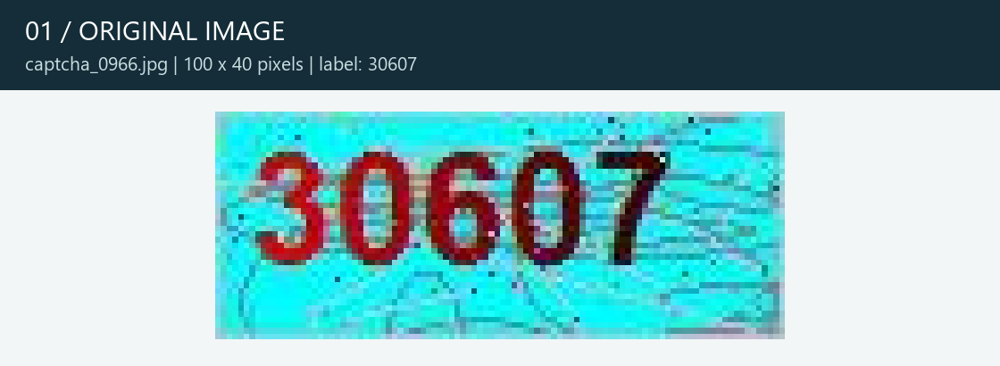
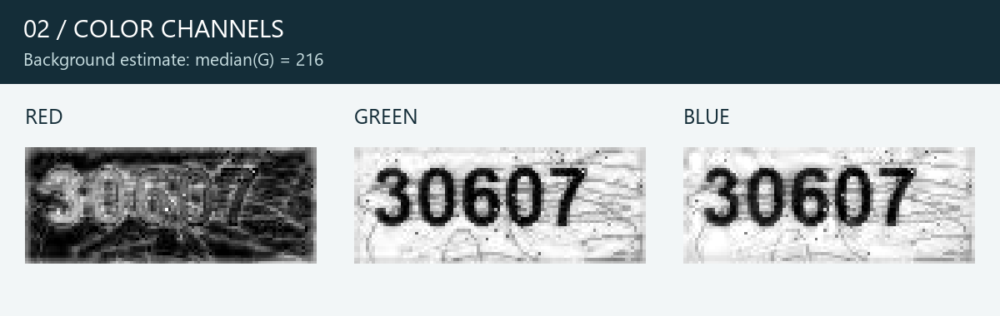
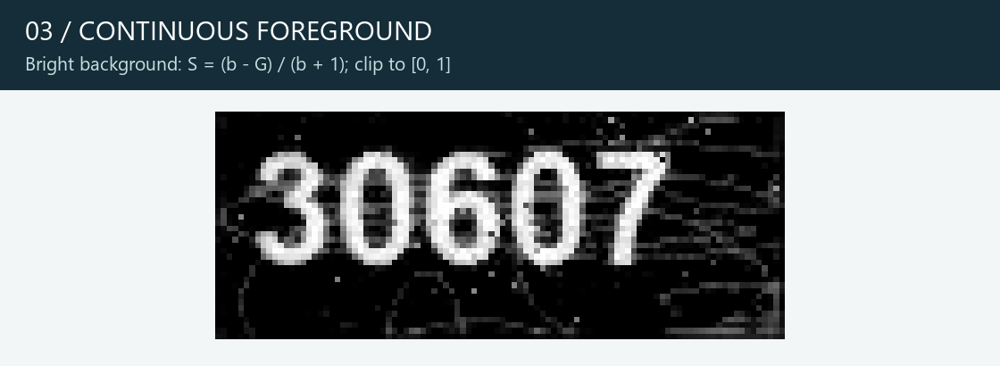
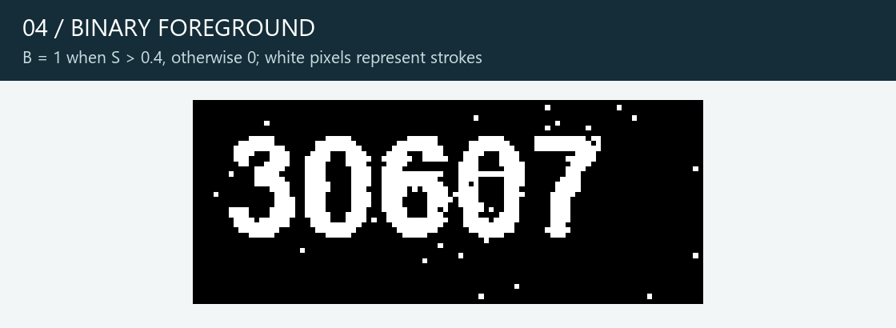
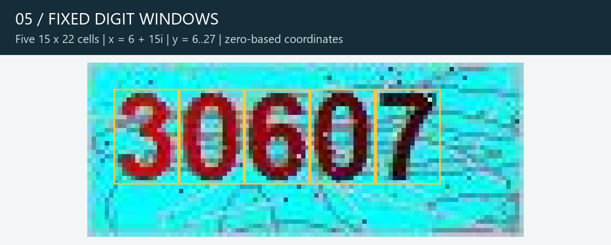
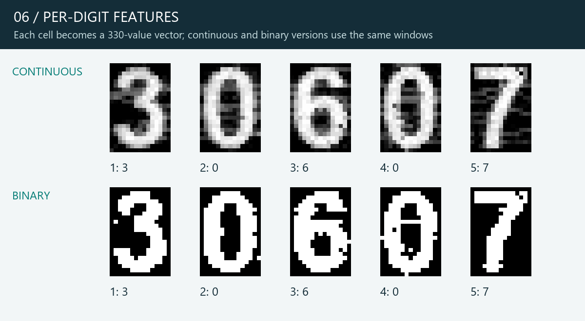
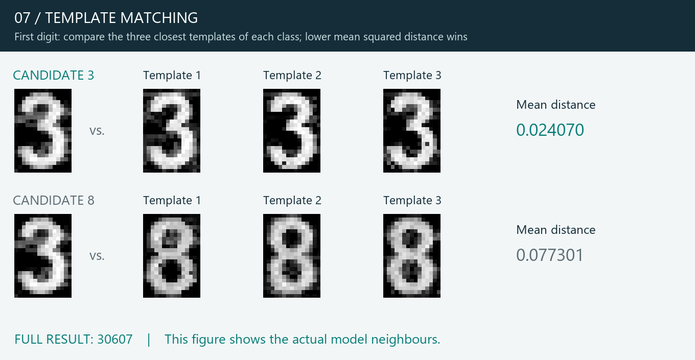

# EZPost CAPTCHA OCR

針對 EZPost 固定版型圖形驗證碼的本機辨識工具，提供 **Python 批次辨識**與 **Chrome／Edge 自動填入擴充套件**。

演算法使用自適應色彩分離與逐字模板比對。40 張圖片建立數字模板，80 張未參與模板建立的目視標註樣本用於驗證。瀏覽器直接辨識頁面已載入的圖片，無需啟動 Python 或額外伺服器。

[快速開始](#快速開始) · [實際網頁操作](#實際網頁操作) · [演算法與處理圖例](#演算法與處理圖例) · [驗證結果](#驗證結果) · [專案結構](#專案結構) · [開發與重現](docs/DEVELOPMENT.md)

## 實際網頁操作

擴充套件限定在 [EZPost 登入頁](https://ezpost.post.gov.tw/Account/Login) 啟用。圖片載入後會自動填入驗證碼，按網站的「重新整理」換圖後也會更新；欄位下方顯示辨識狀態。



*2026-09-12 在實際登入頁擷取的畫面。帳號與密碼保持空白，測試確認圖片辨識與填入，未送出登入表單。*

同次實測的三張新圖片：

| 原圖 | 自動填入 | 目視核對 |
| --- | --- | --- |
|  | `54623` | 一致 |
|  | `97448` | 一致 |
|  | `20364` | 一致 |

## 快速開始

### 使用瀏覽器擴充套件

1. 下載或 clone 本專案，保留 [`extension/`](extension/) 資料夾。
2. Chrome 開啟 `chrome://extensions`；Edge 開啟 `edge://extensions`。
3. 開啟「開發人員模式」，按「載入未封裝項目／載入解壓縮」。
4. 選擇直接包含 [`manifest.json`](extension/manifest.json) 的 **`extension` 資料夾**。
5. 開啟或重新整理 [指定登入頁](https://ezpost.post.gov.tw/Account/Login)。

若使用 ZIP，請先解壓縮再選擇資料夾。安裝後請保留該資料夾；更換套件檔案後，需在擴充功能管理頁重新載入，再重新整理登入頁。

套件允許同一登入路徑的查詢參數及錨點；其他路徑、其他主機、HTTP 與嵌入框架均不啟用。它只填入圖形驗證碼，不讀取帳密、不提交登入，也不另外下載一張驗證碼。詳見 [擴充套件說明](extension/README.md)。

### 使用 Python 批次辨識

需求：Python 3.10 以上。以下指令皆在專案根目錄執行。

```bash
python -m venv .venv
```

啟用虛擬環境：

```powershell
# Windows PowerShell
.\.venv\Scripts\Activate.ps1
```

```bash
# macOS / Linux
source .venv/bin/activate
```

安裝並執行：

```bash
python -m pip install -e .
python -m ezpost_ocr
```

預設讀取 [`dataset/`](dataset/)，輸出 [`reports/predictions.csv`](reports/predictions.csv)。已內附模板，無需先訓練。

```bash
# 指定輸入與輸出
python -m ezpost_ocr --dataset dataset --output reports/predictions.csv

# 重現本專案的驗證報告
python -m ezpost_ocr.evaluation
```

也可作為 Python 套件使用：

```python
from ezpost_ocr import DigitRecognizer

recognizer = DigitRecognizer("models/ocr_model.npz")
result = recognizer.recognize("dataset/captcha_0966.jpg")
print(result["text"])            # 30607
print(result["review_reasons"])  # 需複核的原因；空字串表示未觸發規則
```

CSV 包含檔名、辨識結果、是否需複核、複核原因、二值版本結果、候選分差、字形距離與錯誤訊息。使用 UTF-8 BOM；以 Excel 匯入時，請把辨識結果欄設為「文字」，保留前導零。

## 演算法與處理圖例

這批圖片的文字顏色與背景會改變，但字型、大小與五個數字的位置固定。演算法先依背景選擇色彩處理方式，再以固定字格擷取特徵，最後逐字比對數字模板。

```text
100 × 40 原圖
    → 估計背景綠色通道中位數
    → 自適應色彩分離
    → 連續前景強度 + 二值版本
    → 五個 15 × 22 字格
    → 每一數字類別的三個最近模板
    → 組合五位數 + 複核提示
```

### 三種背景的處理差異

以下全部使用實際資料集圖片與正式演算法輸出。圖中白色代表較強的文字筆畫；圖片以最近鄰放大，方便查看像素。



| 圖片 | 背景綠色中位數 `b` | 處理分支 | 辨識結果 |
| --- | ---: | --- | --- |
| [`captcha_0966.jpg`](dataset/captcha_0966.jpg) | 216 | 綠色反差 | `30607` |
| [`captcha_0845.jpg`](dataset/captcha_0845.jpg) | 136 | 紅綠色差 | `22734` |
| [`captcha_0848.jpg`](dataset/captcha_0848.jpg) | 55 | 校正水平漸變的紅綠色差 | `56412` |

### 1. 讀取原圖

驗證圖片為 **100 × 40** 像素。Windows 路徑可能包含中文，因此 Python 以 `numpy.fromfile` 讀取位元組，再用 `cv2.imdecode` 解碼。以下以 `30607` 展示完整流程。



### 2. 拆分色彩通道並估計背景

令 `R`、`G` 分別為紅、綠通道，`b = median(G)`。使用整張圖片的綠色中位數，判斷背景亮度與適合的分離方式。此範例 `b = 216`，使用亮背景分支。



### 3. 計算文字前景強度

`x` 為從 0 開始的水平像素座標。前景訊號 `S` 的計算如下：

| 條件 | 訊號 `S` | 目的 |
| --- | --- | --- |
| `b > 190` | `(b - G) / (b + 1)` | 利用亮背景與文字之間的綠色反差 |
| `85 < b <= 190` | `(R - G) / (256 - b)` | 以紅綠色差保留偏紅、粉紅色文字 |
| `b <= 85` | `(R - G) / (2.5 × x + 15)`；`R < 100` 時設為 0 | 校正深色背景上文字由白至粉紅的水平漸變 |

再將 `S` 裁切到 `[0, 1]`，形成連續前景強度圖，保留筆畫邊緣的灰度資訊。



### 4. 產生二值版本

另以 `S > 0.4` 產生二值圖。連續版本是主要辨識來源；二值版本用於交叉比較並提供複核提示。



### 5. 擷取固定字格

第 `i` 個字格的裁切範圍為 `x = 6 + 15i` 到 `20 + 15i`、`y = 6` 到 `27`，`i = 0…4`。每格 **15 × 22** 像素。圖中黃色框線表示實際裁切範圍。



### 6. 建立每個字元的特徵

將每個字格展平成 **330 維向量**。連續版本保留 0–1 的強度，二值版本只包含 0 或 1。這個階段利用固定版型，不依賴連通元件去分割黏在一起的筆畫。



### 7. 比對模板並組合結果

40 張 development 圖片共提供 **200 個數字模板**。每一位置分別與 `0` 至 `9` 比對：

1. 計算輸入字格與每個模板的平均平方差：`MSE = mean((input - template)²)`。
2. 每個數字類別取距離最小的三個模板，再計算三者平均距離。
3. 選擇平均距離最小的數字，依序組成五位數字串。

下圖使用第一位數字的實際鄰近模板。候選 `3` 的平均距離約為 `0.024070`，小於候選 `8` 的 `0.077301`，因此選擇 `3`。



辨識時讀取圖片像素與模板，不以檔名查答案，也不讀取標註 CSV。核心實作見 [`ezpost_ocr/algorithm.py`](ezpost_ocr/algorithm.py)，瀏覽器版本見 [`extension/ocr.js`](extension/ocr.js)。

### 複核規則

符合下列任一條件時，仍輸出辨識值，但標記為需複核：

- 連續與二值版本的五位數結果不一致。
- 任一位置的最佳與次佳類別分差小於 `0.02`。
- 任一位置的最佳類別平均距離大於 `0.20`。

圖片損壞、尺寸不符或任一字格的平均前景強度小於 `0.03` 時，記錄錯誤並保留人工輸入流程。以上分數為字形距離，**不是正確機率**。

## 驗證結果

資料集共 1,000 張圖片。固定亂數種子 `20260912` 抽取 120 張，再按檔名排序分成 40 張 development、60 張 holdout、20 張 holdout_extra。後兩組均未用於建立模板；最後 20 張在演算法定案後才目視核對。

| 資料分組 | 原版 Tesseract 完整五位數正確 | 新版完整五位數正確 |
| --- | ---: | ---: |
| Holdout：60 張 | 19 / 60 | 60 / 60 |
| 額外 Holdout：20 張 | 7 / 20 | 20 / 20 |
| **獨立驗證合計：80 張** | **26 / 80（32.5%）** | **80 / 80（100%）** |

- Development 另外採「每次排除整張圖片的五個模板」交叉驗證，結果為 40 / 40。
- 全批 1,000 張輸出中，108 張觸發複核規則，執行錯誤 0 張。
- 瀏覽器 Canvas 解碼與 JavaScript 辨識的 1,000 張結果，全部與 Python 版一致。
- 擴充套件測試涵蓋初次填入、前導零、換圖、連續換圖、圖片元素替換、人工修改保留、錯誤提示及網址限制。

**80/80 是這份抽樣標註上的結果，不代表全批或未來圖片全部正確。** 標註由助手目視核對，並非網站提供的官方答案。首次驗證曾發現一筆縮圖標註錯誤，經原圖複核後修正；詳見 [驗證與資料說明](docs/VALIDATION.md)。

新版固定辨識五個字格，因此「是否為五位數」只是格式檢查，不能當作正確率。

報告：[Python 統計](reports/evaluation.json) · [逐筆比較](reports/evaluation.csv) · [瀏覽器測試](reports/integration_results.json) · [實際頁面測試](reports/live_results.json)

## 專案結構

```text
.
├── ezpost_ocr/          # Python 核心、批次 CLI、模板建立與評估
├── extension/          # 可直接載入的 Manifest V3 擴充套件
├── models/             # 已建立的數字模板
├── dataset/            # 1,000 張原始圖片與下載資訊
├── data/               # 120 張圖片的標註與分組
├── reports/            # 辨識輸出、比較與測試結果
├── scripts/            # 匯出模型、封裝套件、產生文件圖片等工具
├── experiments/        # 原版 Tesseract 與開發階段比較實驗
├── tests/              # Python 測試與瀏覽器整合測試
├── docs/               # 開發、驗證說明與 README 圖片
├── pyproject.toml      # Python 安裝與相依套件
└── package.json        # 瀏覽器測試指令與 Playwright 版本
```

`.venv/`、`.tools/`、`.local/`、`node_modules/` 與 `dist/` 為本機或產物目錄，已透過 `.gitignore` 排除。擴充套件內的 `model.js` 與 `models/ocr_model.npz` 保留，下載專案後即可使用。

## 開發與重現

```bash
# 重建模板，再同步至瀏覽器套件
python -m ezpost_ocr.training
python scripts/export_extension_model.py

# Python 測試與批次評估
python -m unittest discover -s tests -v
python -m ezpost_ocr
python -m ezpost_ocr.evaluation

# 重建本 README 的圖例
python -m pip install -e ".[docs]"
python scripts/build_docs_images.py

# 封裝可供下載的擴充套件 ZIP
python scripts/package_extension.py
```

瀏覽器整合測試另需 Node.js 20 以上：

```bash
npm install
npx playwright install chromium
npm test
```

一般整合測試使用本機資料集攔截測試頁面的請求。若要主動連線到實際網站、重新擷取操作截圖，另執行 `npm run test:live`；此測試不提交登入。完整步驟及舊檔名對照見 [開發說明](docs/DEVELOPMENT.md)。

## 適用範圍

目前模型針對本資料集的 **100 × 40、固定字型、固定字距與位置**。網站更換字型、圖片尺寸、文字位置、色彩分布或表單結構時，需要重新調整並驗證。現有樣本上的距離門檻尚未校正為機率，也未驗證其他網站或其他 CAPTCHA 版型。

## 參考

- [Tesseract 文件](https://tesseract-ocr.github.io/tessdoc/)：原版辨識基準。
- [Chrome content scripts](https://developer.chrome.com/docs/extensions/develop/concepts/content-scripts)：隔離執行環境與內容腳本。
- [Chrome match patterns](https://developer.chrome.com/docs/extensions/develop/concepts/match-patterns)：啟用網址限制。
- [Edge 載入未封裝擴充套件](https://learn.microsoft.com/en-us/microsoft-edge/extensions/getting-started/extension-sideloading)：安裝方式。
